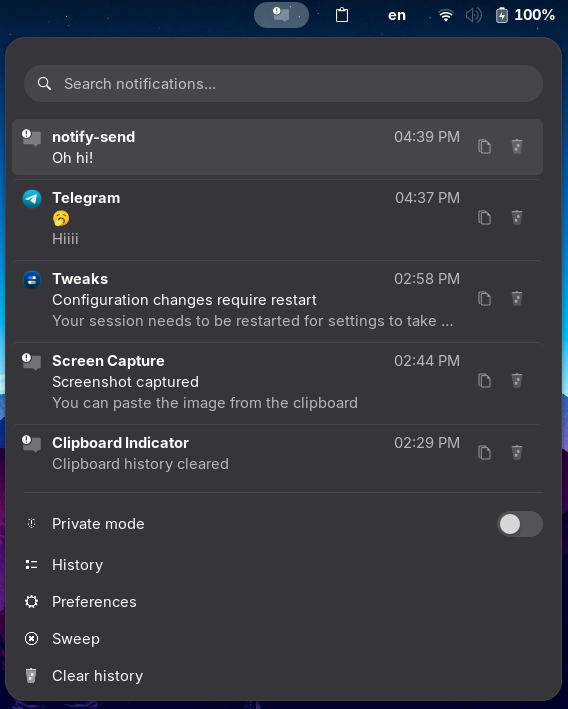

# Hushlog

Hushlog is a small GNOME Shell extension that gives you a local notification history from the top bar.

It is meant to feel like the "notification history" idea on Android: if a notification disappears too quickly, you can open Hushlog and look back. Everything stays on your machine.

Hushlog is early and open to ideas. Suggestions, bug reports, design feedback, and fix requests are welcome.



## What it does

- Keeps a history of your notifications so you can go back to the ones that vanished before you could read them.
- Lives in the top bar with a search box, so finding that one notification from an hour ago is quick.
- Keeps long notifications compact — click one to expand it and read the whole thing.
- Copies a notification's text with one click.
- Has a Private mode for when you'd rather not record anything, plus a blacklist for apps you never want logged.
- Lets you sweep the list clear when it gets noisy, without actually deleting your history.
- Keeps everything on your machine. Nothing ever leaves.

## Privacy

Hushlog does not send anything anywhere. There is no network code, no sync, no telemetry, and no remote service.

The history file lives here:

```text
~/.local/share/hushlog/history.jsonl
```

The extension creates the directory automatically and tries to keep it private to your user account.

If you prefer not to write notification history to disk, enable **Session only** in Settings. In that mode Hushlog keeps history in memory for the current GNOME Shell session and leaves the existing log file untouched.

The default blacklist skips common sensitive apps:

```text
Signal
Authenticator
1Password
Bitwarden
KeePassXC
```

You can edit the blacklist from Settings.

## Requirements

- GNOME Shell 50 or newer
- GJS / GNOME Shell extension support
- `glib-compile-schemas`

## Install from source

Clone the repo, then run:

```sh
make install
```

That copies the extension to:

```text
~/.local/share/gnome-shell/extensions/hushlog@gagoalaverdyan/
```

If GNOME Shell does not notice it immediately, log out and back in.

## Enable

```sh
gnome-extensions enable hushlog@gagoalaverdyan
```

## Open Settings

```sh
gnome-extensions prefs hushlog@gagoalaverdyan
```

Settings currently include:

- How many notifications the menu shows before you open the full History view
- Where the icon sits in the top bar (left, center, or right section, and its order within it)
- The app/source blacklist
- Session-only history, for keeping new notifications in memory instead of writing them to disk
- Opening or clearing the local log file

## Test it

Send a test notification:

```sh
notify-send "Hushlog test" "This should appear in history"
```

Then click the Hushlog icon in the top bar.

Watch GNOME Shell logs while testing:

```sh
journalctl -f /usr/bin/gnome-shell
```

## Package

Create a local install bundle:

```sh
make package
```

This creates:

```text
hushlog@gagoalaverdyan.shell-extension.zip
```

The zip is a build artifact and is ignored by git.

## Uninstall

Disable and remove the extension:

```sh
gnome-extensions disable hushlog@gagoalaverdyan
rm -rf ~/.local/share/gnome-shell/extensions/hushlog@gagoalaverdyan
```

Optionally remove saved history:

```sh
rm -rf ~/.local/share/hushlog
```

## Project layout

```text
metadata.json                                      Extension metadata
extension.js                                       GNOME Shell panel indicator and notification capture
prefs.js                                           Settings window
stylesheet.css                                     Shell menu styling
schemas/org.gnome.shell.extensions.hushlog.gschema.xml
                                                   GSettings schema
media/screenshot.png                               README screenshot
po/                                                Translation source files
Makefile                                           Local install and packaging helpers
```

## Contributing

Ideas and fixes are welcome. A good issue includes:

- What you expected to happen
- What actually happened
- Your GNOME Shell version
- Any relevant logs from `journalctl -f /usr/bin/gnome-shell`

Useful contributions right now:

- Better notification capture across GNOME Shell versions
- UI polish that keeps the menu compact and native-looking
- Privacy-focused defaults and blacklist improvements
- Clear bug reports with reproduction steps

## GNOME Shell API notes

Hushlog uses modern GNOME Shell extension APIs and ESM imports:

```js
import {Extension} from 'resource:///org/gnome/shell/extensions/extension.js';
```

The panel indicator is a `PanelMenu.Button` added with `Main.panel.addToStatusArea()`.

Notification capture uses `Main.messageTray`. Hushlog first tries the tray-level `notification-added` signal where available. It also watches newly added MessageTray sources, then listens for source-level `notification-added` and `notification-updated` signals when those are exposed.

GNOME Shell MessageTray internals have changed across releases, so notification field access is intentionally defensive and signal connections are treated as optional. If Shell 50+ changes signal names again, the extension should still load and unload cleanly, but capture may need a small adapter update in `extension.js`.

## Credits

Inspired by [Clipboard Indicator](https://github.com/Tudmotu/gnome-shell-extension-clipboard-indicator) by Tudmotu.

Thanks to the Clipboard Indicator project — its UI and functionality (the clear-history confirmation dialog, scrollable history, and overall menu layout) directly informed Hushlog's design.

The menu icons come from the [Adwaita](https://gitlab.gnome.org/GNOME/adwaita-icon-theme) / [freedesktop](https://specifications.freedesktop.org/icon-naming-spec/latest/) icon set, provided by your GNOME icon theme at runtime.

## License

Hushlog is free software licensed under the GNU General Public License v3.0 or later. See [LICENSE](LICENSE).
